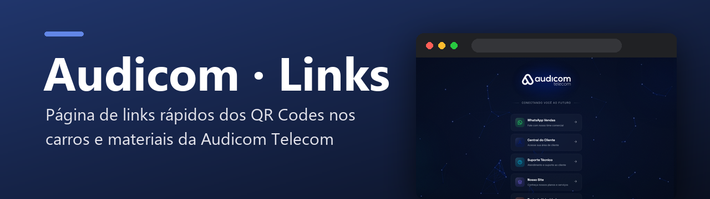
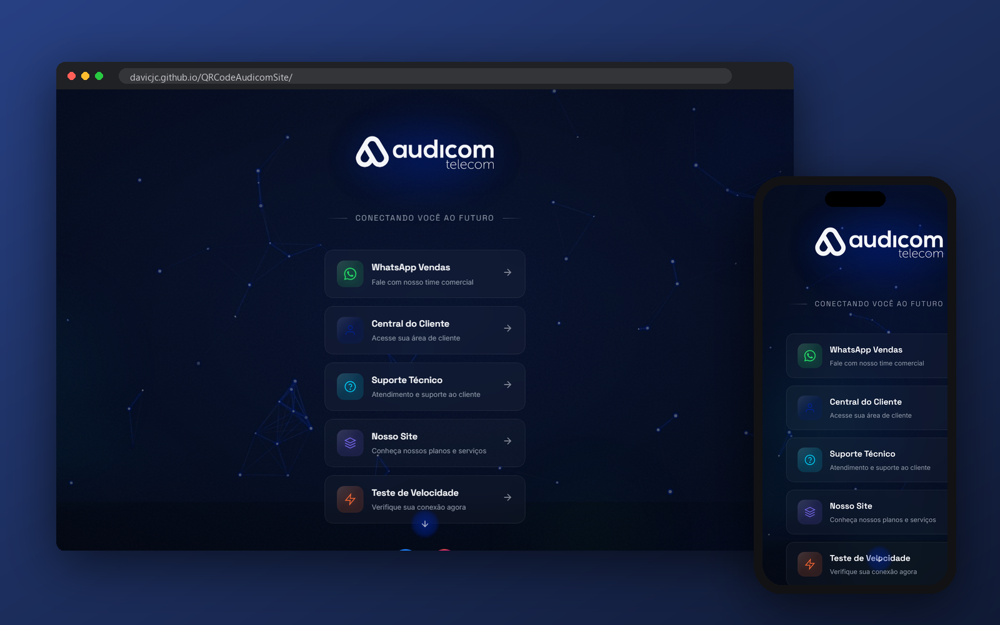

  

  
  
  
  
  

Página de links da Audicom Telecom aberta pelos QR Codes dos carros e materiais: vendas, central do cliente, suporte, site e teste de velocidade.

  

---

## ✨ O que é

Os carros e materiais impressos da Audicom têm um QR Code. Quem escaneia cai nesta página — um “linktree” próprio, com a identidade da marca.

| Botão | Para quê |
|---|---|
| 💬 **WhatsApp Vendas** | falar com o time comercial |
| 👤 **Central do Cliente** | área do assinante |
| 🛠️ **Suporte Técnico** | atendimento |
| 🌐 **Nosso Site** | planos e serviços |
| ⚡ **Teste de Velocidade** | medir a conexão na hora |

O fundo é uma malha animada de “fibra óptica” desenhada em `canvas`, igual à do site principal.

## 🗂️ Estrutura

| Arquivo | O que é |
|---|---|
| `index.html` · `style.css` · `script.js` | a página |
| `QRCode Linktree Audicom/` | arte do QR Code para impressão (EPS/PDF) |
| `assets/` | logos |

---

Desenvolvido por <a href="https://github.com/Davicjc">Davi Castro</a> · <a href="https://davicjc.com">davicjc.com</a> para Audicom Telecom

